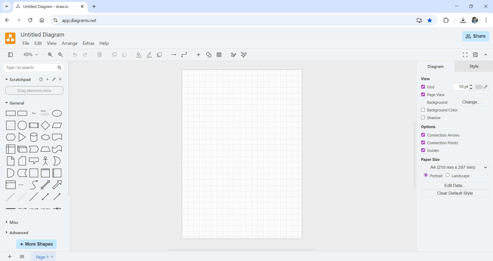
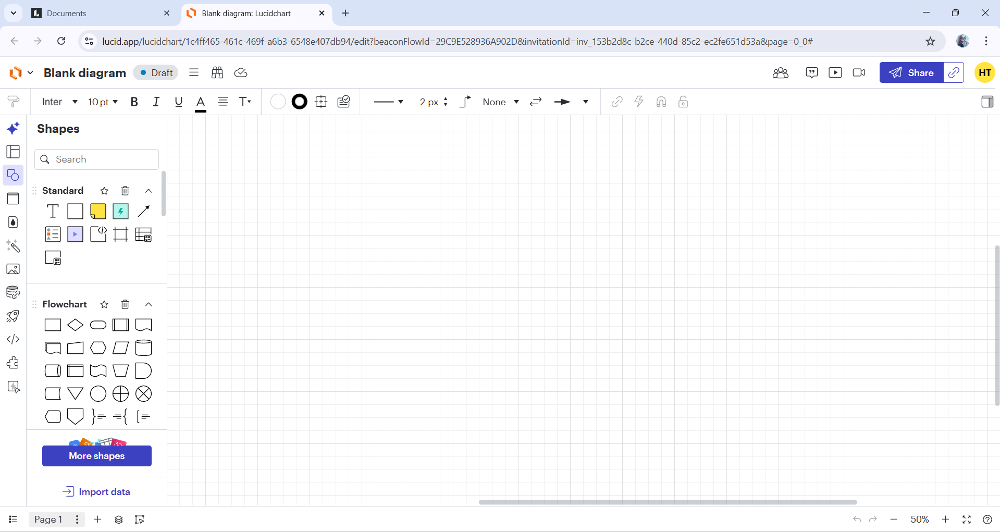
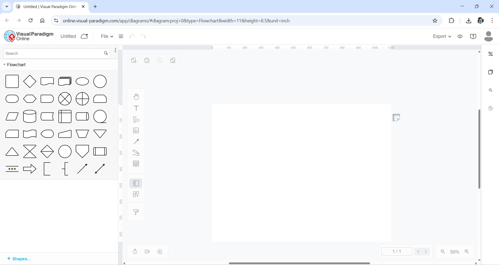

## Thư mục dữ liệu

- **data**  
  Chứa toàn bộ các kịch bản được phân loại theo từng trang web và mô tả dưới dạng JSON.

- **images**  
  Lưu ảnh mà các kịch bản trong thư mục `data` tham chiếu đến.

- **html**  
  Lưu các file HTML dùng cho những trường hợp cần test kịch bản trên file HTML để đảm bảo kịch bản không bị lỗi.

## Danh sách kịch bản cần test trên HTML

### nhandan

- scenario_017.json
- scenario_019.json
- scenario_020.json
- scenario_021.json
- scenario_026.json

### tuoitre:

- scenario_014.json
- scenario_017.json
- scenario_018.json

### bing:

- scenario_007.json
- scenario_010.json
- scenario_011.json
- scenario_012.json
- scenario_013.json
- scenario_014.json

## Giao diện trước khi thực hiện test trên 3 trang drawio, lucid chart và visual paradigm

### drawio

### lucidchart:

### visual paradigm:

